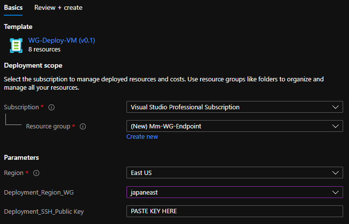
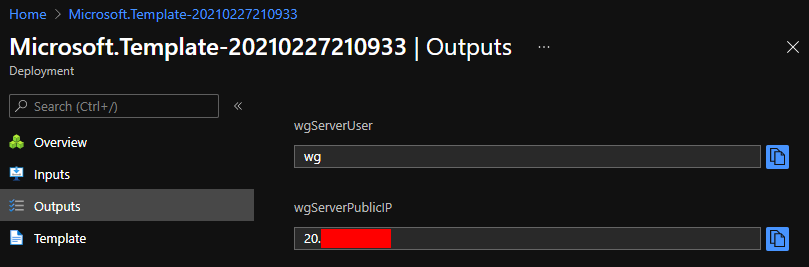
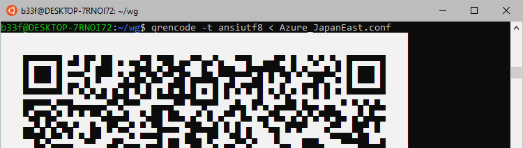

# Private WireGuard VPN on Azure

This is just a quick run-down on setting up a private WG vpn server on Azure in a semi-automated fashion. This can be ideal for:

  - Short term needs (eg I'm travelling somewhere and need a private connection)
  - I need a public IP in X region for Y reason
  - Long term use as well perhaps
  
The Azure ARM template will use a `Standard B1ms` host for the VM which is about `£12` a month so it is not overly pricey.

## Prepare

First you will need to generate the WireGuard client key material on your local host.

```
wg genkey | tee privatekey | wg pubkey > publickey
wg genpsk > presharedkey
```

Next generate an SSH keypair for the Azure VM. Note that when you let a user manually enter their public key as an Azure ARM parameter in the UI then it has to be in the `ssh-rsa` format.

```
ssh-keygen -t rsa -b 2048
```

Open `wg.yml` and fill in your WG public key and PSK on line 5 & 6.

```yml
  vars:
    userPublicKey: XXXXXX
    userPSK: XXXXXX
```

## Deploy

You can deploy the ARM template as you wish but I have personally set up a `Template specs` library in a dedicated resource group so I would import the template there. After importing you can simply click deploy. You will see a screen like the one below.



You should change the `Deployment_Region_WG` to be whichever region you want your endpoint to be in (`japaneast` in my example) and paste your SSH public key in `Deployment_SSH_Public_key`. Then just complete the wizard.

When they deployment has completed successfully, click on the `outputs` tab on the left, this will give you the public IP of the VM and the SSH user name.



## Configure

Now just run the ansible playbook and wait for it to finish.

```
echo PUBLIC_IP > host.txt
ansible-playbook -i host.txt -u wg --private-key=id_rsa wg.yml
```

Right at the end, you will see that the playbook returns two debug messages which will give you details you need to fill in the WG client profile.

```
TASK [Server Public IP] *******************************************************ok: [20.xx.xx.xx] => {
    "msg": "Public Endpoint - 20.xx.xx.xx"
}

TASK [Server Public Key] ******************************************************ok: [20.xx.xx.xx] => {
    "msg": "Public Key - ZIWF0/qXJbNcN2b5upv3Za8Mh953ZJmyTj/yrmsRfEA="
}
```

## Connect

Grab the `client.conf` and fill in the missing details.

```
[Interface]
PrivateKey = <YOUR PRIVATE KEY>
ListenPort = 51820
Address = 10.9.0.2/32
DNS = 1.1.1.1
MTU = 1420

[Peer]
PublicKey = <SERVER PUBLIC KEY>
PresharedKey = <YOUR PSK>
AllowedIPs = 0.0.0.0/0
Endpoint = <SERVER PUBLIC IP>:51820
PersistentKeepalive = 15
```

Then simply configure WG using your platform specific method. In my case after establishing the connection I expect to see a connection in Japan.

```
b33f@DESKTOP-7RNOI72:~/wg$ curl https://ipinfo.io
{
  "ip": "20.xx.xx.xx",
  "city": "Tokyo",
  "region": "Tokyo",
  "country": "JP",
  "loc": "35.6895,139.6917",
  "org": "AS8075 Microsoft Corporation",
  "postal": "151-0052",
  "timezone": "Asia/Tokyo",
  "readme": "https://ipinfo.io/missingauth"
}
```

WireGuard also has an app on Android (and I assume IOS). After you install the app you will be able to import a profile using a QR code, to generate that code you can do the following on your local host.

```
qrencode -t ansiutf8 < client.conf
```

